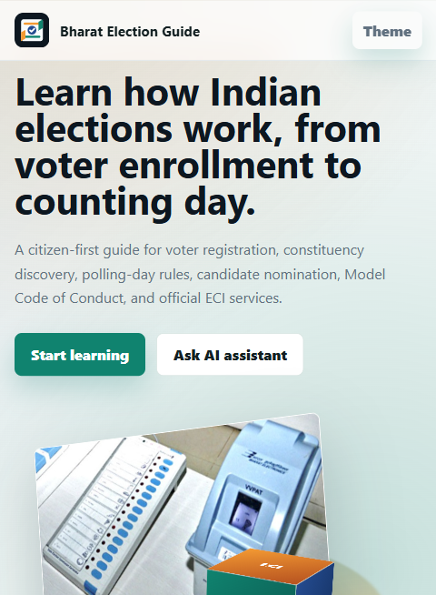
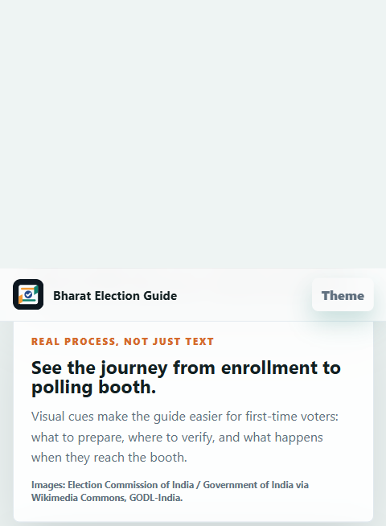

# Bharat Election Guide

Challenge 2 submission for Virtual PromptWars.

## Chosen Vertical

Election Process Education, focused on the Indian election system.

## Approach

The project is a lightweight browser-based civic education guide for Indian elections. It helps citizens understand voter enrollment, constituency lookup, polling-day steps, Model Code of Conduct rules, candidate nomination, EVM/VVPAT basics, counting, and official verification through Election Commission portals.

## Key Features

- India-specific election process timeline.
- AI assistant with offline election guidance and optional live Gemini answers.
- State and Union Territory selector covering all Indian States/UTs.
- Locality input for district, city, town, village, or panchayat guidance.
- Citizen roadmap for Form 6, Form 8, roll search, and polling station lookup.
- Candidate roadmap for nomination, Returning Officer, affidavits, scrutiny, withdrawal, and compliance.
- Model Code of Conduct explanation.
- Official links to ECI voter services, electoral search, candidate affidavits, and results.

## Google Services Used

- Google Maps search links help users find nearby election offices, ERO/BLO support points, and voter-registration help around their selected locality.
- Google Calendar reminder links help users schedule a follow-up to complete Form 6 or check enrollment status.
- Google Gemini integration is available through an optional Google AI Studio API key for live AI answers inside the assistant.
- The app still works without a key through a structured offline guide, so evaluators can test the full experience immediately.

## Product Screens

### Home Experience



### AI Assistant and Roadmap


### Official ECI and Google Helpers



## How It Works

1. Open `index.html` in a browser.
2. Select State/UT, enter locality, age, and your role.
3. Press `Generate Indian election roadmap`.
4. Ask the AI assistant about voter enrollment, constituencies, candidate nomination, MCC, polling timings, panchayat elections, or counting.
5. Optionally connect Google Gemini to upgrade the assistant from offline guide mode to live AI mode.
6. Use official ECI links and Google helpers to verify personal voter details, find offices, and create reminders.

## Assumptions

- ECI conducts Lok Sabha, Rajya Sabha, Presidential, Vice-Presidential, and State Assembly elections.
- Panchayat, municipality, and other local-body elections are generally handled by State Election Commissions, so the guide directs users to state-level SEC portals for ward/panchayat-specific details.
- Officer names and election dates can change, so the app encourages users to verify the latest information on official portals.
- The guide is neutral and does not recommend parties, candidates, or voting choices.

## Security

- No backend server is used.
- No API key is required.
- No personal data is uploaded or stored.
- The assistant avoids political persuasion and focuses on civic process education.

## Testing

- Added automated tests with Node's built-in test runner for context inference, enrollment logic, roadmap generation, offline answers, and Google helper links.
- Manually verified the home experience, roadmap generator, AI assistant prompts, official ECI links, Google Maps helper, Google Calendar helper, and Gemini fallback behavior.
- Checked responsive layouts for desktop and mobile-width browser views.
- Verified the repository remains a single-branch static site with no heavy dependencies.

## Run Tests

```bash
npm test
```

## Deployment Guide

1. Push the latest code from `main` to GitHub.
2. In Google Cloud Shell, clone the GitHub repository.
3. Deploy the static site to Cloud Run using a simple web server image or your existing deployment flow.
4. After deployment, open the Cloud Run URL and confirm the home section, assistant section, and official-links section render correctly.
5. Re-submit the updated Cloud Run URL and GitHub link only if the challenge allows another attempt.

## Accessibility

- Semantic HTML sections and labels are used.
- The chat log uses `aria-live` for updates.
- The UI supports keyboard input and responsive mobile layouts.
- Dark mode is available.

## Image Credits

- EVM/VVPAT image: Election Commission of India, Government of India, via Wikimedia Commons, GODL-India.
- Indelible ink polling-booth image: Election Commission of India / Government of India via Press Information Bureau and Wikimedia Commons, GODL-India.

## Repository Size

This project has no external dependencies or generated build output, so it stays well below the 10 MB repository limit.
